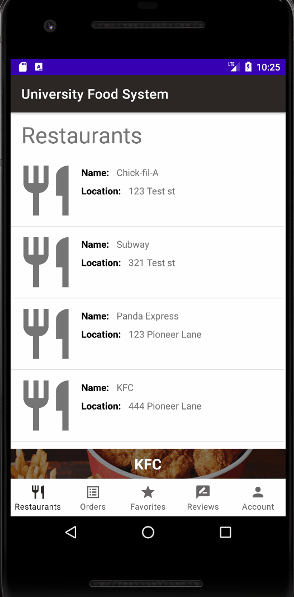
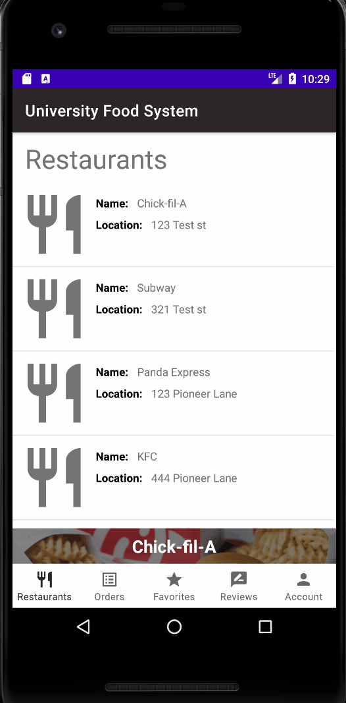
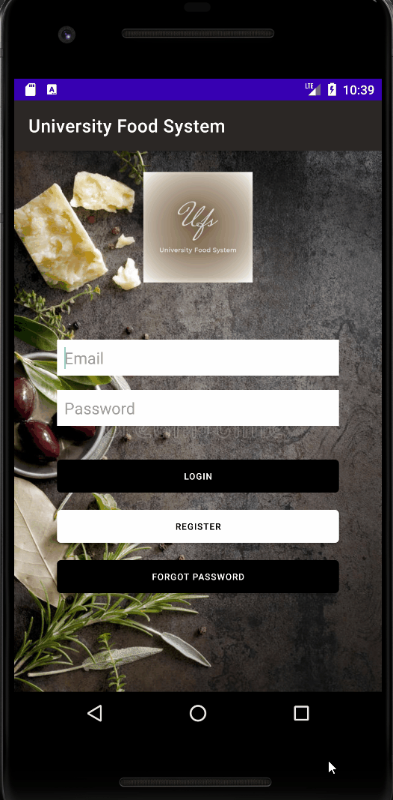
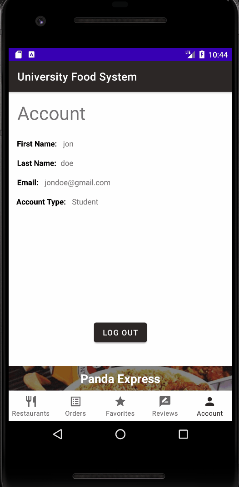

# University Food System (Grubhub Clone)
An android application that allows students to order from a selection of restaurants in the app. Students can also favorite and review restaurants. Restaurants can manage their restaurant info and menu. They can also view orders placed by students and view the reviews placed by the students.

## Students can order from restaurants
A student can add items from their cart and checkout. They can pay with their meal plan or with a credit card. If they pay with their meal plan they have to provide their university id for verification. They can also choose to pick it up or have it delivered for a $5.00 fee.  

---

## Students can favorite and review restaurants
Students can favorite restaurants and review them. The restaurant will be able to view the review from the user.

--- 

## Restaurants can manage their menu's 
Restaurants can add, edit and delete items from their menu. They can also edit their restaurants name and location.

--- 

## Restaurants can update delivery / pickup status of order
When a student places an order the restaurant can view the order info and update the delivery / pickup status.

