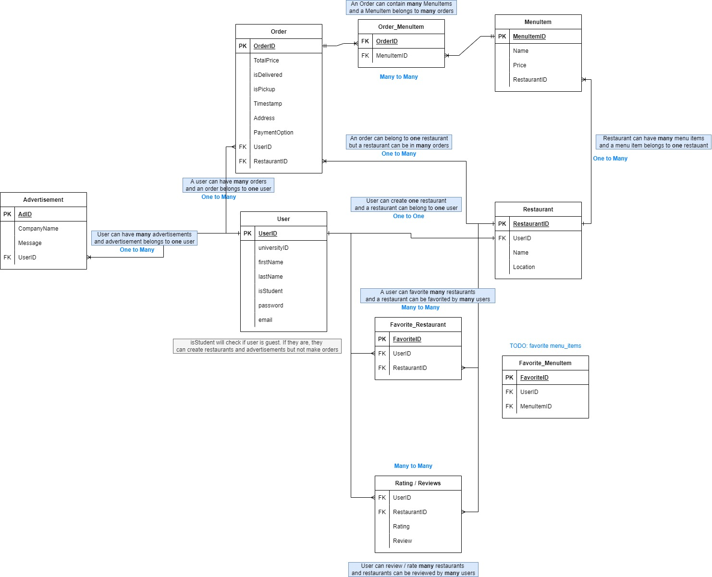

# View Database Data 
1. Get a database client like [TablePlus](https://www.tableplus.io/) or [SQLite browser](https://sqlitebrowser.org/)
2. Open the app in an emulator and create a user or perform other DB interaction
3. Open Device File Controller in Android Studio
4. Go to `data > data > com.example.ufs > databases`
5. Right click on `databases` folder and click `Synchronize` to make sure the databse file is updated.
5. Right click on `ufs.db` file and `Save as`. Save to computer
6. Open the file `ufs.db` in database client downloaded in step 1

## If database is updated
If data is added, edited or removed from the database through the app you will need to perform steps **2 - 6** above.

## If a database table is changed
If database schema is changed like table name, table column name or anything else do the following:
1. Go to `data > data > com.example.ufs > database` and **delete** the `ufs.db` file (note: this will delete the whole database including any users and other data)
2. Open app and create a user or perform other DB interaction
3. Go to `data > data > com.example.ufs > databases`
4. Right click on `databases` folder and click `Synchronize` to make sure the databse file is updated.
5. Right click on `ufs.db` file and `Save as`. Save to computer
6. Open db file in database client


---

# Add data to database with code
All of the methods to access data from database are in `DataBaseHelper.java`. You will need to create an instance of the database helper.

Example: if you want to create a user in the registration activity
```java
...
UserModel newUser = new UserModel("first name", "last name", "email" "university id", "password", 1);

// DatabaseHelper takes in the context 
DatabaseHelper dbo = new DatabaseHelper(Registration.this);
boolean u_success = db.addUser(newUser);

if(u_sucess) { // successful creation }
else { // failed creation }

...
```

Look through the `DataBaseHelper.java` file for the rest of the methods available.

---

# Get isLoggedIn boolean
Sometimes you need to check if user is logged in
```java
...

SP_LocalStorage sp = new SP_LocalStorage(<activity context here>);
boolean isLoggedIn = sp.getIsLoggedIn();
...

```

Example in MainActivity.java
```java
...

SP_LocalStorage sp = new SP_LocalStorage(MainActivity.this);
boolean isLoggedIn = sp.getIsLoggedIn();
...

```

---

# Get the ID of the logged in user
You will need to get the id of the logged in user to relate the user to other tables in the database like the restaurants or orders.
```java
...
SP_LocalStorage sp = new SP_LocalStorage(<context here>);
int loggedInUserId = sp.getLoggedInUserId();
...
```

Example: If in main activity or any activity
```java
...
// MainActivity should be replaced with the name of the activity you are in
SP_LocalStorage sp = new SP_LocalStorage(MainActivity.this);
int loggedInUserId = sp.getLoggedInUserId();
...
```

Example: If in fragment
```java
...
// Inside the onCreateView method

Context ctx = getActivity().getApplicationContext();
SP_LocalStorage sp = new SP_LocalStorage(ctx);
int loggedInUserId = sp.getLoggedInUserId();

...

```

# Navigate through fragments
1. First go to `nav_graph.xml` in `res > navigation > nav_graph.xml`
2. Create an arrow between the fragments you want. If the fragment is not there, add it.
3. Go to `Build > Rebuild Project` at the top of android studio. This will create methods you will need.
4. Select the fragment and give it an id.
5. Go to the source fragment java file (the fragment you navigating from) and go to the `onCreateView` method

6. Type the following in the event handler of a button. The following code is an example from the `CreateRestaurantFragment.java` file. Here we are navigating from the createRestaurant fragment back to the my restaurant fragment
```java
onCreateView() {
	...
	View view = inflater.inflate(R.layout.fragment_create_restaurant, container, false);

	// Get action from the CreateRestaurantFragment. This will go back to the MyRestaurantFragment
	@NonNull NavDirections action = CreateRestaurantFragmentDirections.actionCreateRestaurantFragmentToRestaurantsFragment2();
	NavController navController = Navigation.findNavController(view);
	navController.navigate(action);
	...
}
```
**NOTE:** the method names like `CreateRestaurantFragmentDirections.actionCreateRestaurantFragmentToRestaurantsFragment2` are based on the id given to the fragment in the `nav_graph.xml` file. This is the code generated from step 3.

## Send arguments to fragment
Sometimes you want to send data from 1 screen to another. This is done by passing arguments to the destination fragment

1. Select to the destination fragment (fragment you are going to send data to) in `nav_graph.xml`
2. In the side view find `Arguments` and click the `+` icon
3. Name the argument and add a default value if needed.
4. Go to `Build > Rebuild Project` in android studio to generate methods

**Example with `MyRestaurantFragment` and `CreateRestaurantFragment`**
* When editing a restaurant, arguments like the `restaurantId`, `restaurantName` and `restaurantLocation` are sent to the `CreateRestaurantFragment` to put in the input fields.

In `MyRestaurantFragment.java` file to *send* arguments
```java
public View onCreateView(LayouInflater inflater, ViewGroup container, Bundle savdedInstanceState) {
	...

	// Create action to go to the CreateRestaurantFragment
	MyRestaurantFragmentDirections.ActionRestaurantsFragmentToCreateRestaurantFragment action =
			MyRestaurantFragmentDirections.actionRestaurantsFragmentToCreateRestaurantFragment();

	// Assign the arguements for the CreateRestaurantFragment
	action.setRestaurantId(restaurant.getId());
	action.setRestaurantName(restaurant.getName());
	action.setRestaurantLocation(restaurant.getLocation());

	// Navigation to destination fragment
	NavController navController = Navigation.findNavController(view);
	navController.navigate(action);

	...
}

```

In `CreateRestaurantFragment.java` file (the destination) to *get*  arguments
```java
public View onCreateView(LayouInflater inflater, ViewGroup container, Bundle savdedInstanceState) {
	...

	// Create action to go to the CreateRestaurantFragment
	boolean isArgsAvailable = getArguments() != null;
	if(isArgsAvailable) {
		// Notice the CreateRestaurantFragmentArgs class was generated from step 4 above.
		// The name will change depending on the fragment name
		 CreateRestaurantFragmentArgs args = CreateRestaurantFragmentArgs.fromBundle(getArguments());

		 // get arguments
		 int id = args.getRestaurantById();
	}
	...
}

```


# Database design

